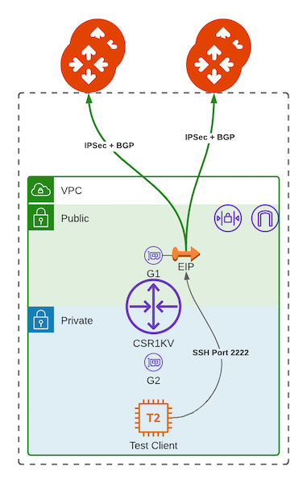

# Aviatrix-Demo-Onprem-AWS

This module simplifies the creation of a CSR1KV in AWS with with External Connections to Aviatrix Gateways for simulating on-prem environments. The resources created by the module are pictured below:



**NOTE**: This module utilizes the CSR1K BYOL offer in the AWS Marketplace.
- Offer Link: https://aws.amazon.com/marketplace/pp/prodview-tinibseuanup2

# Instructions

This Module requires the AWS and Aviatrix Provider to be defined and configured in the root module. The Module automatically creates the external S2C connections from the CSR to the specified Aviatrix Transit gateways and configures the CSR with the correct crypto settings, BGP settings, and Tunnels. Module invocation looks like so:

```terraform
# Optionally, create multiple aliased providers to deploy CSRs across multiple regions
provider "aws" {
	alias   = "use1"
	region  = "us-east-1"
}

provider "aws" {
	alias   = "usw2"
	region  = "us-west-2"
}

# Call the Module and provide necessary info.
# public connections (using public IP) and private connections (e.g., using DX) 
# are defined separately to allow mix-and-match.
# format for the connection definition is: 
# "avx-gw-name:avx-gw-bgp-as:num-vrfs"
# NOTE: Please currently set num vrfs to 1. It is reserved for future use
module "demo-onprem-1" {
  source                                = "github.com/gleyfer/aviatrix-demo-onprem-aws"
  providers                             = { aws = aws.use1 }
  hostname                              = "avxOnprem-East1"
  network_cidr                          = "172.16.0.0/16"
  public_sub                            = "172.16.0.0/24"
  private_sub                           = "172.16.1.0/24"
  advertised_prefixes                   = ["10.20.0.0/16","10.30.0.0/16"]
  instance_type                         = "t2.medium"
  public_conns                          = [ "Test-Transit:64525:1", "TestWest-Transit:64526:1"]
  private_conns                         = [ "Test-Transit:64525:1" ]
  csr_bgp_as_num                        = "64527"
  create_client                         = true
}

module "demo-onprem-2" {
  source                                = "github.com/gleyfer/aviatrix-demo-onprem-aws"
  providers                             = { aws = aws.usw2 }
  hostname                              = "avxOnprem-West2"
  network_cidr                          = "172.31.0.0/16"
  public_sub                            = "172.31.0.0/24"
  private_sub                           = "172.31.1.0/24"
  advertised_prefixes                   = ["10.20.0.0/16","10.30.0.0/16"]
  instance_type                         = "t2.medium"
  public_conns                          = [ "Test-Transit:64525:1", "TestWest-Transit:64526:1"]
  private_conns                         = [ "Test-Transit:64525:1" ]
  csr_bgp_as_num                        = "64528"
  create_client                         = true
}
```

Example of getting outputs:

```terraform
# Get Public IP of CSR
output "CSREast1_Pub_IP" {
  value = module.demo-onprem-1.public_ip
}

# Get command to directly SSH into the CSR via IP
# Ex: ssh -i private_key.pem ec2-user@<CSR Public IP>
output "CSREast1_SSH_Cmd" {
    value = module.demo-onprem-1.ssh_cmd_csr
}

# Get command to ssh into test client via forwarded port
# Ex: ssh -i private_key.pem ec2-user@<CSR IP> -p 2222
output "CSREast1_SSH_Cmd_Client" {
    value = module.demo-onprem-1.ssh_cmd_client
}

# Get generated CSR configuration/user_data for debugging
output "CSREast1_User_Data" {
    value = module.demo-onprem-1.user_data
}
```

Explanation of module arguments:

- **aws_region:** The AWS region into which to deploy the CSR1K.
- **hostname:** The hostname which will be configured on the CSR and which will prefix all of the resources created.
- **key_name:** If you have an existing SSH key in AWS which you would like to use for the CSR & test client login you can put the name here. CSR will automatically be provisioned an admin user with a password of: Password123!
- **network_cidr:** The CIDR block to use for the VPC which the CSR will reside in.
- **public_sub:** The public subnet for the CSR public facing interface.
- **private_sub:** The private subnet for the CSR private facing interface. If enabled, the test client will be created in this subnet.
- **advertised_prefixes:** Custom list of prefixes to advertise to Aviatrix Transit. Will create static routes to Null0 for these prefixes on the CSR and redistribute static to BGP.
- **instance_type:** The instance type to launch the CSR with. Default is t2.medium.
- **public_conns:** List of public external connection definitions (please see above example for format). Tunnels will be created to primary and hagw automatically.
- **private_conns:** List of private external connection definitions (For DX, please see above example for format). Tunnels will be created to primary and hagw automatically.
- **csr_bgp_as_num:** BGP AS Number to use on the CSR.
- **create_client (optional):** If enabled, creates an amazon linux instance in the private subnet, configures public SG to allow port 2222 and configures a port forward on the CSR to allow SSH into the test instance using the CSR IP and port 2222. SSH Key used for the instance will either be the one specified in key_name or generated automatically. Disabled by default.

Module outputs:

- **public_ip:** Public IP of CSR instance
- **hostname:** Hostname of CSR Instance
- **ssh_cmd_csr:** SSH Command to directly access the CSR
- **ssh_cmd_client:** SSH Command to access the test client
- **user_data:** Generated CSR bootstrap IOS configuration.
